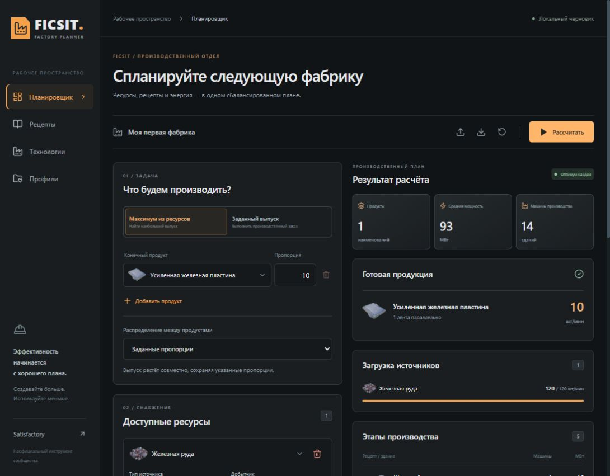
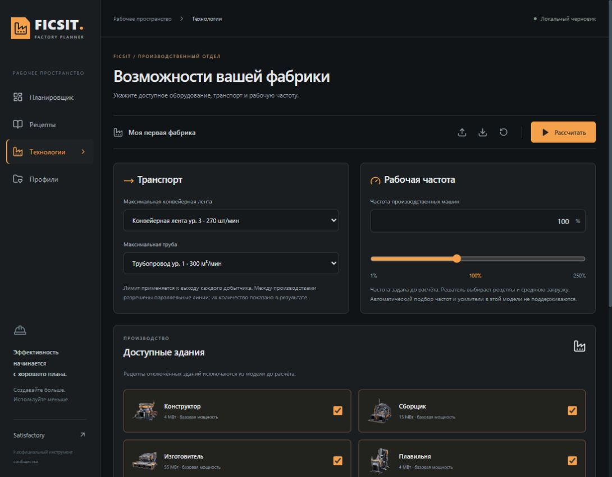

# Аудит функционала с точки зрения геймплея

Дата исходного аудита: 2026-09-06. Каталог: steam-24656030-v1. Исходная сборка: 127.0.0.1:3002.

## Доработка остатка после P2 — 2026-09-06

Текущий результат заменяет прежние оговорки ниже о недоступной плавильне,
неизвестной стоимости скважин, ручных категориях и отсутствующем графе MAM.

| Остаток | Выполнено |
| --- | --- |
| F03 | Импортированы 10 ветвей MAM, 110 узлов и 8 фаз HUB; справочник и цепочки закрытых рецептов. Родители/видимость — ИЛИ, условия Docs — И групп с ИЛИ внутри. Завершение пользователь отмечает вручную |
| F04 | 28 игровых RU/EN категорий, 152 связи предметов, 276 рецептов, 37 переопределений; ручная эвристика удалена |
| F10, плавильня | Подтверждён общий слот подсистемы: эффективное число слотов 1. Проверка: 30 руды → 60 слитков/мин, 16 МВт |
| F01/F10, скважины | Стоимость одного компенсатора и каждого настроенного спутника импортируется из единичных строительных рецептов и включена в ведомость |
| F11 | Клавиатура, возврат фокуса, ошибки числового ввода, краткие объявления статусов, диалоги и мобильный заголовок исправлены и проверены |

Проверки: **163/163 Vitest**, TypeScript и production build — PASS;
проверены **32 Chrome-сценария** (31 в полном прогоне, последний после обновления
устаревшего ожидания повторно — PASS). Новые изменения прошли независимые обзоры.
Импорт четырёх производных файлов побайтово воспроизводим.

Остались проверяемые границы источника: у семи категорий отсутствует приоритет,
у пяти MAM-узлов есть ссылки на отсутствующие координаты. Неизвестные связи не
считаются выполненными; полное совпадение порядка меню не заявляется.
Подбор предметов, события и завершение фаз калькулятор не наблюдает.
Фактические испытания с игроками и настоящим скринридером ещё не проведены:
подготовлены [протокол и три JSON-плана](2026-09-06-player-validation.md).
Это не полная аттестация WCAG.

Источники, семантика и проверка извлечения: [отчёт по assets](2026-09-06-game-assets.md).
Текущий статус: [STATUS](../STATUS.md). Ниже сохранена история P1/P2 и исходный аудит.

## Перепроверка после P1 — 2026-09-06

Исходные сценарии, снимки и формулировки ниже относятся к состоянию **до P1**.
Они сохранены как доказательства исходного аудита, а не описание текущего UI.
Повторно прочитаны domain/types, availability, construction, worlds, solver/build,
solve, validate, App, Planner и спецификация P1. До новых изменений запущен
`pnpm test`: **125/125 PASS**, включая API, строительные цепочки и все политики.

| Пункты | Актуальность на начало P2 |
| --- | --- |
| F01, F02, F05 | Реализованы инструкция, физические машины, пик/резерв, лимиты и сравнения целей. Автоподбор частот не заявляется |
| F03 | Реализованы миры/фабрики и прогресс; полный граф условий исследований по-прежнему отсутствует |
| F04 | Реализованы категории, поиск и сравнения; точное соответствие категорий меню игры не подтверждено |
| F06, F07 | Реализованы проверяемые расширения, нулевой максимум и жёсткие границы продуктов |
| F11 | Реализованы сводка, SCC, KPI, имена источников и подача данных; полный аудит доступности и исследование с игроками не проводились |
| F08 | Частично подготовлен: имена источников и миры уже есть; линии, резерв и общие квоты ещё отсутствуют |
| F09 | Актуален: Plan пока не содержит партии, запасов и срока |
| F10 | Актуален: целочисленная модель P1 теперь позволяет бюджет усилителей; скважины и рекомендации по запуску ещё отсутствуют |

Пользователь запросил реализацию P2 (F08–F10). Принятые технические решения и
проверяемые границы находятся в [плане P2](../plans/2026-09-06-p2.md).
Ниже «сейчас», «нет» и «следующий этап» следует читать в контексте исходного аудита.

## Результат реализации P2

- **F08 реализован:** отдельные существующие линии с фиксированными рецептами,
  частотами и физическими количествами; закрепление выпуска либо использование
  свободной мощности; сравнение трёх способов расширения; ведомость новых машин.
  Добавлены заметки, резерв, известная/неизвестная энергия импорта и квоты общих
  узлов мира с проверкой общей суммы при сохранении рабочего пространства.
- **F09 реализован:** партия хранит количество, запас и срок; остаток переводится
  в целевой поток один раз, готовые позиции имеют ноль. Срок относится к работе
  после выхода на режим. Невыполнимый заказ сохраняет исходные количества.
- **F10 реализован с явно указанными границами данных:** целочисленный бюджет
  Somersloops, общие компенсаторы и спутники, конечные отгрузки и рекомендации
  запуска циклов. Слоты плавильни пока не подтверждены: Docs дают ноль, Wiki — один;
  усиление Smelter отключено. Стоимость объектов скважины отмечена неизвестной.
  Автоподбор частот и динамика трубопроводов не заявляются.

Механики сверены с закреплёнными игровыми Docs, дополнительно проверено описание
[усиления](https://satisfactory.wiki.gg/wiki/Production_Amplifier) и
[разгона скважин](https://satisfactory.wiki.gg/wiki/Tutorial:Advanced_clock_speed).
Точные результаты проверок и оставшиеся ограничения: [STATUS](../STATUS.md).
Исходные снимки ниже не заменены изображениями нового интерфейса.

## Вывод

Калькулятор уже закрывает поиск сбалансированных производственных потоков. Главный следующий шаг — превращать расчёт в понятную инструкцию для строительства и помогать выбирать компромиссы между энергией, сырьём, количеством зданий и удобством фабрики.

Это экспертный аудит, основанный на текущем интерфейсе, коде, контрольных расчётах и механиках игры. Интервью с игроками и измерения поведения пользователей не проводились. Приоритеты ниже — рекомендации, а не согласованное расширение объёма разработки. Автоподбор частот и усилители сознательно исключены из V1; их отсутствие не является регрессией.

## Проверенные сценарии и экраны

1. **Постановка задачи — работает, требуется упрощение.** Оба режима видны; источники и расширенные ограничения требуют прокрутки. Для одного продукта показывается выбор политики распределения и числовая пропорция, хотя относить её не к чему. Стоит скрывать эти поля до появления второго продукта и показывать краткую сводку ограничений рядом с расчётом.

2. **Получение результата — работает, переход к строительству неполный.** Выпуск, средняя мощность и загрузка источников читаются отдельно. Первый KPI считает наименования, хотя в расчёте одного продукта полезнее его выпуск. Таблица машин не задаёт индивидуальные частоты и распределение потоков между потребителями.

3. **Выбор рецептов — поиск работает, сравнение и группировка требуют доработки.** Запрос «винт» возвращает 14 рецептов, включая потребляющие винты. Это полезный поиск по ингредиентам, но нужен переключатель «производит / использует / везде». Каталог представлен общей сеткой; категории существуют как фильтр и метки, без секций с заголовками. Карточки дают значения за цикл, но не расход в минуту, мощность и влияние на весь план.

4. **Настройка технологий — ручной контроль работает, прогрессия не моделируется.** Есть ленты, трубы, общая частота и включение типов зданий. По умолчанию доступны все здания. Нет пресетов этапов прохождения, отдельных исследований и бюджета энергомодулей.

5. **Возвращение к фабрике — частично проверено.** Осмотрен гостевой экран профилей и код хранения полного Plan. Вход и запись аккаунта в этом аудите не выполнялись. Локальный черновик и JSON позволяют начать без регистрации; отдельного общего прогресса мира, наследуемого несколькими фабриками, нет. Это вывод по структуре данных и коду, а не по снимку авторизованного экрана.

Снимки получены заново в этом аудите и проверены после сохранения. Исходные настройки плана не менялись; выполнен расчёт и временный поиск, экран возвращён в планировщик.

## Контрольные расчёты

Расчёты выполнены текущим solver с текущим каталогом; производственная частота 100%, базовые рецепты, кроме явно указанной альтернативы. Число зданий ниже включает только производство, без добычи.

| Сценарий | Выпуск | Сырьё | Средняя мощность | Установленная/пиковая оценка | Здания |
|---|---:|---|---:|---:|---:|
| Максимум из одного обычного железного узла, бур Mk.2 | 10 усиленных пластин/мин | 120 железа/мин | 93 МВт | 93 МВт | 14 |
| Заданный выпуск при том же источнике | 7,5 усиленных пластин/мин | 90 железа/мин | 69,75 МВт | 89 МВт | 13 |
| Выпуск 10, дополнительно разрешён «Альт.: литой винт» | 10 усиленных пластин/мин | 120 железа/мин | 82,6 МВт | 85 МВт | 12 |
| 1 мотор/мин, природное сырьё как неограниченные внешние потоки | 1 мотор/мин | 31,5 железа; 8 меди; 9 угля/мин | 38,1 МВт | 93 МВт | 12 |

В последней строке энергия добычи неизвестна и исключена. Эти цифры не являются замером работающей фабрики в игре. Первый запуск вспомогательного сравнения остановился из-за неверно предположенного ID альтернативы; после чтения каталога использован фактический ID `alt-screw`, повторный запуск успешен. Ошибка не относится к приложению.

## Приоритеты

P1 — следующий этап развития; P2 — после него. Размер S/M/L относительный, без обещаний сроков. Подтверждённых критических поломок по объёму этого продуктового аудита не заявляется.

### F01 · P1 · Инструкция для строительства · L

**Основание:** шаг 2; `Results.tsx`, `solve.ts`. Для заказа 7,5 пластин показаны, например, 1,5 сборщика из 2. Сейчас это эквивалент работы при заданной частоте с простоями. Игроку нужно понять, какие настройки поставить в каждую машину.

**Предложение:** отдельный режим «Построить»: число машин, рецепт, частота каждой группы машин, вход/выход на одну машину, общий поток, добытчики и утилизаторы отдельными строками. Копирование значения для ввода в игре, отметка «построено», ведомость материалов самих зданий. Не оценивать длины лент и площадь размещения без геометрической модели.

**Критерий:** итоговые потоки и MW пересчитаны для показанной конфигурации. Нельзя просто заменить 1,5 машины на 2×75% и сохранить прежнюю энергию/заявление об оптимуме: энергопотребление нелинейно зависит от частоты. Для полноценного выбора частот нужны предел количества машин, пределы частоты и бюджет энергомодулей. [Механика частот](https://satisfactory.wiki.gg/wiki/Underclock).

### F02 · P1 · Ограничение электросети и понятные границы оптимума · M–L

**Основание:** шаги 2 и 4; `build.ts:98` ограничивает среднюю мощность. Значение 69,75 МВт при оценке пика 89 МВт демонстрирует разницу. Ограничение честно подписано как среднее, но сценарий «у меня осталось 70 МВт в сети» оно полностью не закрывает.

**Предложение:** разные поля «бюджет средней мощности» и «допустимая максимальная нагрузка»; рядом с результатом — запас сети и исключённые затраты внешних поставок. Консервативный максимум считать по физическим машинам и максимумам рецептов. Учитывать резерв как настройку пользователя.

**Критерий:** при ограничении максимума 70 МВт план с оценкой 89 МВт не получает отметку соответствия этому ограничению. Возможности накопителей и фазовые сдвиги циклов требуют отдельной модели, поэтому резерв не должен обещать динамическую симуляцию. [Отключение сети при превышении генерации](https://satisfactory.wiki.gg/wiki/Buildings).

### F03 · P1 · Прогресс мира и отдельные фабрики · M–L

**Основание:** шаги 4–5; `defaults.ts`, `Technologies.tsx`, `Profiles.tsx`, `types.ts`. Выбор типов зданий не равен открытию всех рецептов, использующих эти здания. Профиль хранит полный план.

**Предложение:** сущности «Мир/прохождение» и «Фабрика». У мира — HUB/MAM, открытые альтернативы, транспорт, доступность разгона; у фабрики — источники, заказ и локальные исключения. Смена прогресса применяется к связанным планам после понятного просмотра изменений. Пресеты по этапу должны позволять уточнять отдельные исследования, а не считать весь tier автоматически пройденным.

**Критерий:** недоступный рецепт объясняет, что открыть; новая фабрика наследует прогресс, сохраняя собственные ограничения. Существующие планы мигрируются без потери данных. [Игровые этапы и открытия](https://satisfactory.wiki.gg/wiki/Milestones).

### F04 · P1 · Каталог и полезность альтернатив · M

**Основание:** шаг 3; `Recipes.tsx`, `source/menu-evidence.json`. Требование группировки как в игре выполнено частично. Порядок внутри тематических категорий импортирован, но заголовки и состав групп пока не подтверждены игровыми category assets.

**Предложение:** сворачиваемые категории с количеством открытых/выбранных рецептов; альтернативы рядом с базовым продуктом; переключение «за цикл / в минуту / на единицу выхода»; энергия на единицу выхода при указанной частоте. Разделить «открыт в мире» и «разрешён в плане». Не подменять точные игровые категории правдоподобной ручной классификацией.

**Дополнение:** кнопка «Сравнить для моей фабрики». В контрольном примере литой винт даёт тот же выпуск и сырьё, но −10,4 МВт средней мощности и −2 производственных здания. Нужен именно пересчёт всей цепочки: сравнение только энергии самой машины не учитывает промежуточные производства.

**Критерий:** сравнение показывает изменённые рецепты, MW, здания, источники и выпуск; исходный план сохраняется. Поиск явно различает производство предмета и его использование. Это также основа помощника выбора награды жёсткого диска; совместную пользу нескольких альтернатив нужно считать отдельно от одиночного включения.

### F05 · P1 · Выбор простоты строительства · M–L

**Основание:** шаги 1–2; `Settings`, цели в `solve.ts`. Сейчас оптимизируются выпуск, энергия и взвешенный расход источников. Физическое количество машин не является самостоятельной целью.

**Предложение:** сравнимые варианты «экономия энергии», «меньше зданий», «экономия выбранного сырья». Дополнительно — ограничения на число зданий конкретного типа и разрешённую потерю выпуска. При равных основных целях предпочитать меньше разных рецептов и мелких производственных веток. Не выдавать число машин за точную площадь или время строительства.

**Критерий:** варианты используют один и тот же заказ и ограничения; игрок видит цену экономии в MW, сырье и зданиях. Взвешенное сырьё обозначено условной стоимостью: сумма железа, воды и редких материалов с весом 1 не является универсальным показателем дефицита.

### F06 · P1 · Объяснение ограничений и полезного расширения · M

**Основание:** шаг 2; `solve.ts` сообщает исчерпанные источники и общий список возможных причин невыполнимости. Достижимая доля заказа уже существует и должна сохраниться.

**Предложение:** показывать конкретный следующий шаг: дополнительный источник, открытие рецепта, увеличение MW. Для оценки пользы изменения делать повторный расчёт, а не считать любой заполненный источник доказанной причиной ограничения выпуска. Добавить пустое состояние «нет производственного пути» для математически оптимального нулевого выпуска.

**Критерий:** объяснение воспроизводится повторным решением с названным изменением; при нескольких совместных ограничениях это указано. Проверять случаи дефицита сырья, выключенного здания, заблокированного побочного продукта и нулевого максимума.

### F07 · P1 · Минимум каждого продукта плюс максимум оставшегося · M

**Основание:** шаг 1; `Target` не содержит нижней/верхней границы. Три согласованные политики реализованы, и UI предупреждает о возможном нуле младшего продукта.

**Предложение:** к существующим политикам добавить минимальную потребность и необязательный верхний предел каждого продукта. Сценарий: «минимум 5 моторов/мин для снабжения, остальное направить на каркасы». Это полезнее попыток вручную подобрать веса, чтобы случайно получить нужный минимум.

**Критерий:** минимум не нарушается ради веса/приоритета; невыполнимость минимума показана отдельно; существующие пропорции, приоритеты и веса остаются доступными.

### F08 · P2 · Расширение существующей фабрики · L

**Основание:** шаги 1, 2, 5. Внешний поток уже позволяет использовать готовые промежуточные продукты; отсутствует описание установленного оборудования и неизменяемых линий.

**Предложение:** «уже построено», фиксированные рецепты/частоты, свободная мощность линии и сравнение «оставить / добавить / перестроить». Источникам дать названия, заметки и резерв для других фабрик. При нескольких планах одного мира учитывать общий лимит узла, чтобы не распределить одну добычу дважды.

**Критерий:** расчёт расширения не меняет закреплённые линии; ведомость показывает добавляемые здания отдельно от существующих. Стоимость энергии импорта остаётся явно заданной или неизвестной.

### F09 · P2 · Заказ для космического лифта и склада · M

**Основание:** `Plan` описывает стационарный выпуск в минуту. Нет количества на складе, размера партии и времени завершения.

**Предложение:** режим партии: требуемое количество, имеющийся запас, желаемое время. Из этих данных формируется цель в минуту; отдельно показывается оценка времени после выхода фабрики на режим. Сценарии — детали лифта, исследования, пополнение строительных материалов.

**Критерий:** запас вычитается один раз, готовые позиции не требуют новой выработки, склад не превращается в бесконечный источник или утилизацию. Время запуска/заполнения конвейеров не выдаётся за рассчитанное без соответствующей модели.

### F10 · P2 · Усилители, скважины и циклические цепочки · L

**Основание:** шаг 4, `types.ts`, `STATUS.md`. Усилители отсутствуют по согласованному объёму V1; скважины с общим компенсатором также не поддерживаются. Баланс циклов уже считается, но инструкции запуска нет.

**Предложение:** бюджет Somersloops и распределение по физическим зданиям после реализации модели частот/количества машин; источник-скважина с общим компенсатором и спутниками; предупреждения о возвратных жидкостях, начальном заполнении замкнутых контуров и назначении побочных продуктов. Нужны способы вывести полезный побочный продукт в другую фабрику, а не только отправить его в Sink.

**Критерий:** усилители увеличивают выход и энергопотребление по механике, расходуют конечный бюджет; общий компенсатор не считается отдельно для каждого спутника. Стационарный баланс не называется доказательством беспроблемного запуска трубопровода. [Усиление производства](https://satisfactory.wiki.gg/wiki/Production_Amplifier), [скважины](https://satisfactory.wiki.gg/wiki/Resource_Well_Pressurizer).

### F11 · P1 · Быстрые улучшения подачи информации · S–M

**Основание:** шаги 1–4 и код интерфейса.

- Сводка активных ограничений у кнопки расчёта: доступные рецепты/здания, транспорт, частота, границы энергии. Цель «энергия → сырьё» сейчас спрятана внизу формы.
- Нумерация этапов должна соответствовать зависимостям. В контрольном расчёте мотора порядок начинается с ротора, статора и мотора, затем идут слитки. Сейчас это порядок каталога, а не инструкция строительства. Циклы показывать единым блоком с внутренними связями.
- Для одиночной цели заменить KPI «1 наименований» на выпуск; исправить склонения. Для нескольких продуктов сохранять отдельные количества, не суммировать несопоставимые изделия.
- Рядом с каждым источником показывать доступный поток до расчёта и причину ограничения: чистота, бур, частота, лента. В результате различать одноимённые источники по названию.
- Уточнить статус каталога по разделам: рецепты, мощность, локализация, группировка. Общая фраза «непроверенные данные» не помогает понять, влияет ли неопределённость на текущую цепочку. При этом не объявлять всю числовую часть проверенной только на основании исправления трёх рецептов.
- Карточкам ускорителя частиц и других зданий с переменной/зависящей от рецепта мощностью не давать одну «базовую мощность» без пояснения.
- Увеличить второстепенный текст и проверить контраст: на осмотренном экране подписи мелкие и приглушённые. Это визуальный риск, а не установленное нарушение WCAG. Нужны измерение цветов, полный проход клавиатурой, screen reader и отдельная проверка мобильного представления.

## Что сохранить

- Два режима и все три политики распределения.
- Русский поиск по названиям и ингредиентам, локализованные иконки/названия.
- Разделение запрещённых, ограниченных и неограниченных ресурсов.
- Учёт побочных продуктов и баланс циклов; отсутствие «исчезающих» жидкостей.
- Раздельные средняя и установленная мощность, предупреждения об импорте энергии.
- Достижимую альтернативу для невыполнимого заказа без молчаливого изменения целей.
- Локальный черновик, JSON и персональное хранение.
- Таблицы, раскрываемые строки и карточки; Sankey для предложенных сценариев не нужен.

## Предлагаемый порядок разработки

1. **Понятность результата:** F11, первая часть F04, конкретные причины F06. Закрыть точные категории по игровым assets отдельной задачей.
2. **Пригодность к текущему прохождению:** F03, сравнение альтернатив F04, смешанные цели F07.
3. **Строительство и энергия:** согласовать модель частот/числа машин, затем F01, F02 и F05 совместно, чтобы отображение не расходилось с оптимизатором.
4. **Долгая игра:** расширение фабрик F08, партии F09, усилители/скважины F10.

Проверять пользу на трёх игровых сценариях: первая самостоятельная фабрика; нефтяная/алюминиевая цепочка с побочными продуктами; расширение уже построенного производства. Измерять, может ли игрок без ручного пересчёта настроить машины, понять ограничение и выбрать альтернативу. До такого теста ожидаемая польза остаётся гипотезой.

## Границы аудита и доказательства

- Осмотрены desktop-планировщик, результат, рецепты, технологии, гостевые профили; текущий браузерный viewport приблизительно 1090×850.
- Выполнены четыре контрольных расчёта, поиск по русскому фрагменту и навигация. Авторизованное хранение, мобильный интерфейс и полный набор автоматических тестов заново не проверялись; код приложения не менялся.
- Числа контрольных сценариев относятся к локальному каталогу. Это не новая полная сверка всех рецептов с последним публичным патчем.
- Игровые механики сверены с доступным поисковым содержимым Official Satisfactory Wiki на дату аудита. Прямое открытие части страниц возвращало 403; использовано содержание, возвращённое поиском. Wiki — документирование механик сообществом, а не исследование потребностей всех игроков.
- Основные места в коде: `apps/web/src/{Planner,Results,Recipes,Technologies,Profiles}.tsx`, `packages/domain/{types,defaults}.ts`, `packages/solver/{build,solve}.ts`, `packages/game-data/source/menu-evidence.json`.
